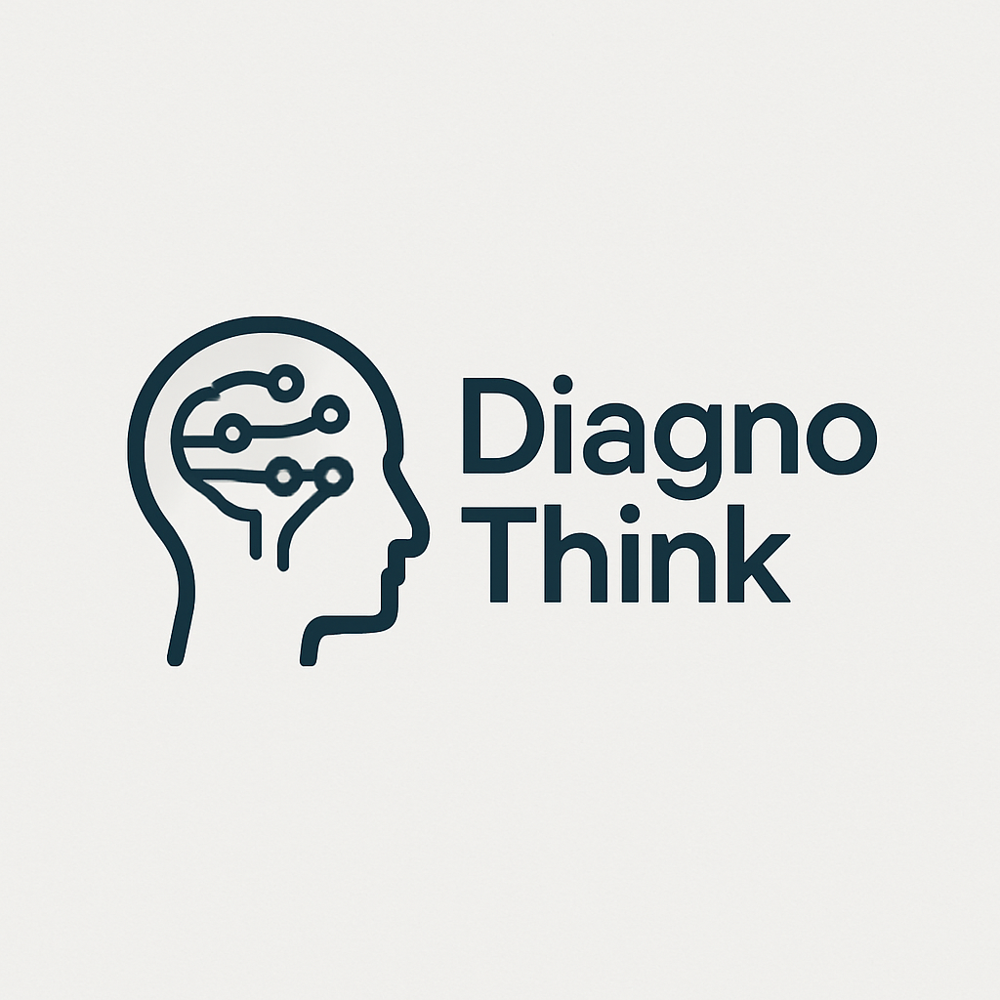
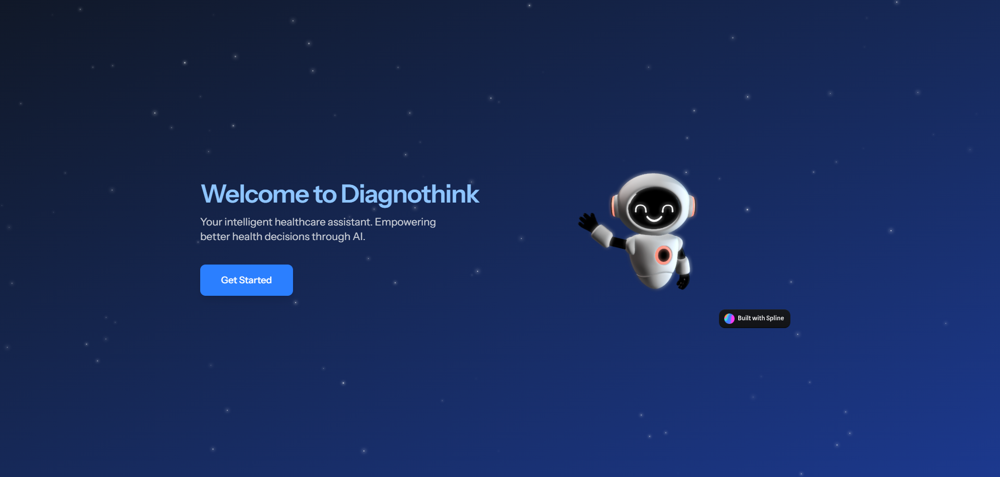
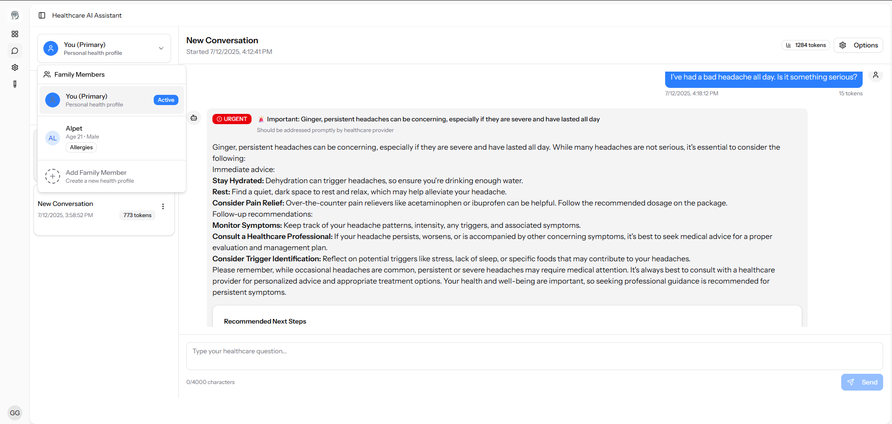

# Diagnothink Healthcare AI Assistant

## Overview

Diagnothink is an intelligent healthcare assistant platform built with Laravel (backend) and React (frontend). It leverages AI to provide personalized healthcare guidance, advice, and information to users in a conversational interface. The platform focuses on delivering accurate, well-structured healthcare information with appropriate urgency indicators and product recommendations when relevant.

## Features

### Intelligent Conversation System

- AI-powered healthcare assistant that provides professional medical information
- Personalized responses based on user profiles (age, gender, medical history, allergies, medications)
- Real-time chat interface with markdown support
- Conversation history and management
- Token optimization to handle longer conversations efficiently

### Enhanced Response Format

- **Structured Information Display**:
  - Short, digestible summaries
  - Detailed explanations with key points
  - Urgency/status indicators (Critical, Urgent, Medium, Light)
  - Personalized content based on user profiles

- **Product Recommendations**:
  - Automatic extraction of product recommendations from AI responses
  - Web search integration to find relevant product links
  - Organized display of product options with source attribution

- **Clinical Context**:
  - Warning indicators for important health information
  - Next steps recommendations with priority levels
  - When-to-seek-help criteria
  - Related symptoms, conditions, and treatments

### UI Features

- Responsive design for all devices
- Dark/light mode support
- Collapsible sections for detailed information
- Urgency badges for critical information
- Conversation management (archive, export, delete)
- Token usage statistics

## Technical Architecture

### Integration Features

- Web search for product recommendations using DuckDuckGo
- Structured data flow between backend services and frontend display
- Rate limiting for API protection
- Token usage tracking and optimization

## Getting Started

### Prerequisites

- PHP 8.3+
- Laravel 12+
- React
- MySQL
- OpenAI API Key

## About

Diagnothink is designed to provide accessible healthcare guidance through AI. While it offers valuable health information, it is not a replacement for professional medical advice, diagnosis, or treatment. Always consult qualified healthcare providers for medical concerns.
